# 🚀 Selenium to Playwright Converter (Local LLM)

  

A professional, local-first web application designed to modernize legacy test automation. This tool leverages **Local LLMs (CodeLlama)** to deterministically convert **Selenium Java** code into **Playwright TypeScript**, ensuring data privacy and zero cloud dependency.

Built with the **B.L.A.S.T.** (Blueprint, Link, Architect, Stylize, Trigger) Protocol and **Antigravity** architecture.

---

## 🏗️ Architecture

The system operates on a 3-layer architecture, running entirely on your local machine to ensure code privacy.

```mermaid
graph TD
    subgraph Client [Local User Environment]
        User["👩‍💻 User"]
        Browser["🌐 Web Interface (React/Vite)"]
    end

    subgraph Core [Local Processing Node]
        Ollama["🦙 Ollama Service"]
        Model["🧠 CodeLlama:7b Model"]
    end

    User -->|Pastes Java Code| Browser
    Browser -->|HTTP POST JSON| Ollama
    Ollama -->|Inference| Model
    Model -->|Generated TypeScript| Ollama
    Ollama -->|Response| Browser
    Browser -->|Syntax Highlighted Code| User

    style Client fill:#f9f9f9,stroke:#333,stroke-width:2px
    style Core fill:#e1f5fe,stroke:#0277bd,stroke-width:2px
    style Ollama fill:#ffecb3,stroke:#ff6f00,stroke-width:2px
```



---

## ✨ Features

-   **🔒 100% Local & Private**: No code leaves your machine. Powered by Ollama.
-   **🧠 Deterministic Conversion**: Optimized prompts to limit hallucinations and ensure 1:1 logic translation.
-   **💎 Premium UI**: Glassmorphism design system, dark mode, and VS Code-like syntax highlighting.
-   **⚡ Real-time Feedback**: Connection status indicator for your local AI service.
-   **🛡️ B.L.A.S.T. Protocol**: Structured architecture separating UI, Logic, and AI layers.

---

## 🛠️ Tech Stack

-   **Frontend**: React 18, TypeScript, Vite
-   **Styling**: Vanilla CSS (Variables, HSL Colors), Glassmorphism aesthetics
-   **AI Engine**: [Ollama](https://ollama.com/) (running `codellama`)
-   **Syntax Highlighting**: `react-syntax-highlighter` (Atom Dark theme)

---

## 🚀 Getting Started

### Prerequisites

1.  **Node.js** (v18+)
2.  **Ollama** installed and running.
3.  **CodeLlama Model**:
    ```bash
    ollama pull codellama
    ```

### Installation

1.  **Clone the repository**:
    ```bash
    git clone https://github.com/aman2743/Selenium2PlaywrightLocalLLM.git
    cd Selenium2PlaywrightLocalLLM
    ```

2.  **Install Frontend Dependencies**:
    ```bash
    cd ui
    npm install
    ```

### Usage

1.  **Start Ollama** (in a separate terminal):
    ```bash
    ollama serve
    ```

2.  **Run the App**:
    ```bash
    # From the ui/ directory
    npm run dev
    ```

3.  **Open Browser**:
    Navigate to `http://localhost:5173`

4.  **Convert**:
    -   Paste your Selenium Java code in the left panel.
    -   Click **Convert ➜**.
    -   Copy the Playwright TypeScript result.

---

## 📂 Project Structure

```
Selenium2PlaywrightLocalLLM/
├── architecture/          # SOPs and Design Docs (B.L.A.S.T. Layer 1)
│   ├── conversion_sop.md
│   └── frontend_architecture.md
├── ui/                    # Frontend Application
│   ├── src/
│   │   ├── components/    # Reusable UI Blocks (CodeEditor, CodeViewer)
│   │   ├── services/      # API Layer (Ollama Communication)
│   │   ├── App.tsx        # Main Controller
│   │   └── index.css      # Design System (Tokens & Styles)
├── gemini.md              # Project Constitution & Data Schemas
├── task_plan.md           # Implementation Roadmap
└── README.md              # Documentation
```

---

## 🤝 Contributing

1.  Fork the repository.
2.  Create your feature branch (`git checkout -b feature/AmazingFeature`).
3.  Commit your changes (`git commit -m 'Add some AmazingFeature'`).
4.  Push to the branch (`git push origin feature/AmazingFeature`).
5.  Open a Pull Request.

---

**License**: MIT
